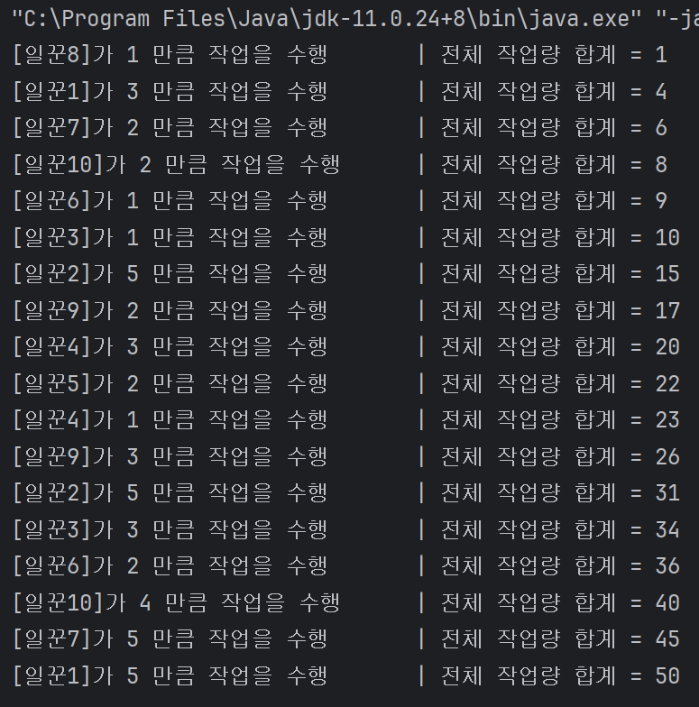

# Personal-Study-Project

---

## [3주차 실습]

### 예제

- 일꾼이 10명이 될 때, 1초 마다 번갈아 가며, 업무량(1 ~ 5)를 수행하면서 합계 업무량를 출력하세요.

---

### Multi Thread 환경에서 벌어지는 문제점

    

#### 원인

- 여러 Thread 가 동시에 작업을 수행하여, 공유 자원의 값을 읽고 쓰는 타이밍이 서로 달라서 값의 일관성이 깨진 경우입니다.

#### 해결 방법

- 이러한 문제를 해결하기 위해선 여러 스레드가 한꺼번에 작업을 수행할 수 없도록 동기화 처리를 수행하세요.

---

### 결과

    

